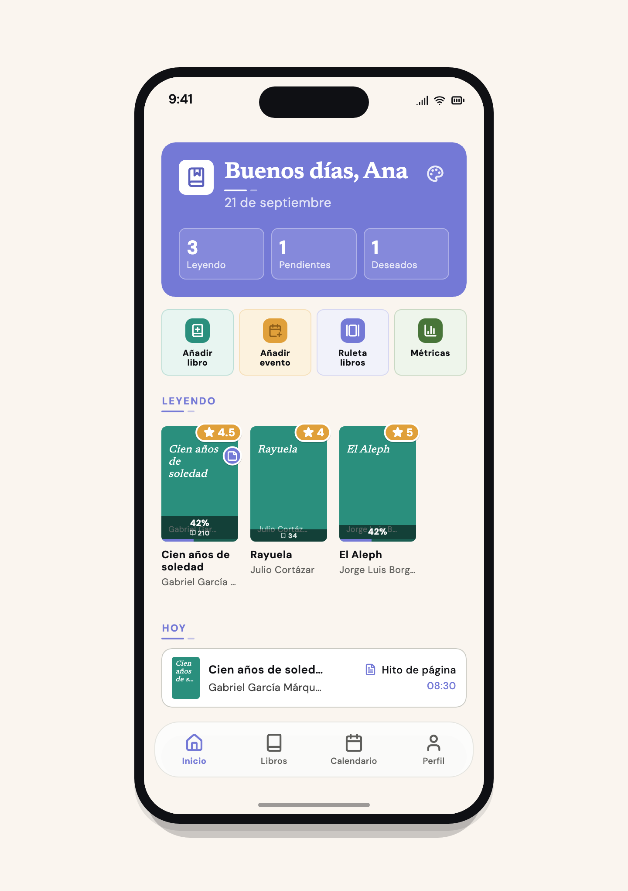

<p align="center">
  
</p>

<h1 align="center">Readendar</h1>

<p align="center">
  <strong>Your reading life, on the device.</strong><br>
  Library, calendar, plans, quotes, and widgets. Local-first.
</p>

<p align="center">
  <a href="https://github.com/dbalas/readendar/actions/workflows/ci.yml"></a>
  <a href="LICENSE"></a>
  <a href="https://play.google.com/store/apps/details?id=com.readendar.readendar"></a>
</p>

<p align="center">
  
</p>

Readendar is a Flutter app for Android and iOS. Your library lives in SQLite
on the phone. A fresh install is a guest library. No account required.

The UI ships in Spanish today. More locales are welcome. Book search uses
[Open Library](https://openlibrary.org/), Empathy / Casa del Libro, and the
BNE. Extra catalog sources are welcome when they fit the local-first model.

## What you can do

- **Library.** Own copies with status (reading, pending, wanted, read),
  progress, ratings, notes, and custom fields. Scan an ISBN, search a catalog,
  or add a book by hand. Import from Goodreads CSV and Kindle.
- **Home.** Greeting, shelf of what you are reading, and today's events. A
  book roulette when you cannot choose.
- **Calendar.** Starts, finishes, page and chapter milestones, deadlines,
  returns, and releases. Month, week, and day views with local reminders.
- **Plans.** A reading plan at your pace for any book in the library.
- **Quotes and notes.** Quotes, theory, questions, and private notes. Type,
  dictate, or photograph a page (on-device OCR). Kindle highlight import.
  Share a quote as a card.
- **Widgets.** Native home-screen widgets on iOS and Android, fed from the
  on-device library.
- **Appearance.** Material on Android, Cupertino / glass on iOS, on purpose.
  Themes (including premium palettes) stay on the device. Cover-derived color
  is opt-in and computed locally.

Help: [hello@readendar.com](mailto:hello@readendar.com).

## Stack

| Piece | Choice |
|---|---|
| App | Flutter 3.44.6+, Dart 3.12+ |
| State | Riverpod |
| Storage | SQLite (`sqflite`) on device |
| UI | Adaptive `Rd*` widgets in `app/lib/core/widgets/` |
| Tokens | [`design/colors_and_type.css`](design/colors_and_type.css) |
| Tests | `flutter test` (CI on `main` and pull requests) |

## Run

Flutter 3.44.6 or newer (see `app/pubspec.yaml`).

```bash
cd app
flutter pub get
flutter gen-l10n                   # only after ARB changes; gen/ is committed
flutter run
```

The app boots a local guest library with no extra config.

## Layout

```
readendar/
├── AGENTS.md              # contributor + agent architecture (CLAUDE.md → same)
├── app/                   # Flutter (Android + iOS)
│   ├── lib/core/          # theme, widgets, models (no feature UI)
│   ├── lib/data/          # SQLite and catalog HTTP
│   ├── lib/di/            # Riverpod composition
│   ├── lib/features/      # screens
│   └── test/              # mirrors lib/
├── design/                # tokens, fonts, brand SVGs
└── .github/workflows/     # CI
```

## Tests

```bash
cd app && flutter test test/path/to/focused_test.dart
cd app && flutter test
```

Do not hand-edit `app/lib/core/l10n/gen/`. Change `app/lib/core/l10n/arb/app_es.arb`,
run `flutter gen-l10n`, and commit the generated files.

Contributor docs and code comments are English. Never use an em dash in
user-visible copy.

## Contributing

Please read [CONTRIBUTING.md](CONTRIBUTING.md) and the
[Code of Conduct](CODE_OF_CONDUCT.md). Public source trees are `app/` and
`design/` only.

## License and trademark

Apache License 2.0. See [LICENSE](LICENSE), [SECURITY](SECURITY.md), and
[TRADEMARK.md](TRADEMARK.md).

The Readendar name, logo, and Rendi mascot are **not** licensed. Forks must
rebrand: new name, new icon, new mascot if you ship one.
